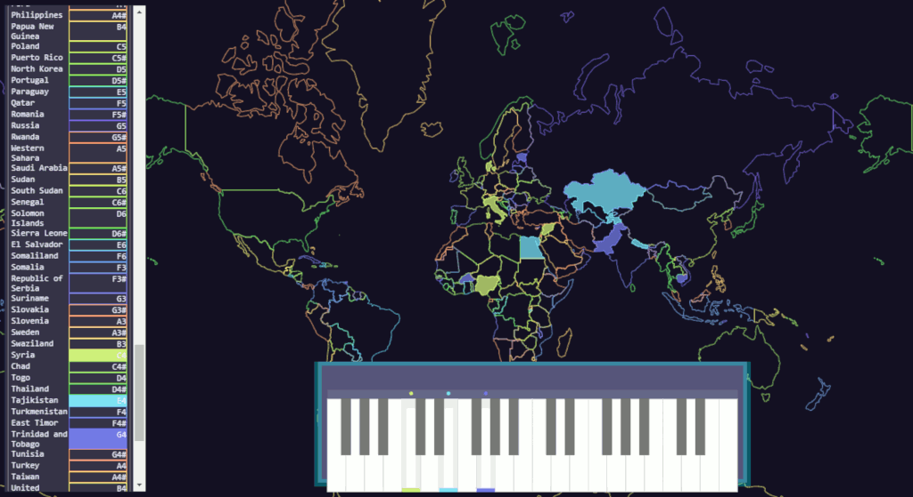

# Piano map

Experiment to connect colors, audios and surfaces on a map. The piano plays by pressing the key with a mouse or with the computer keyboard. Made with Svelte and OpenLayers.

country.geo.json data from https://github.com/johan/world.geo.json